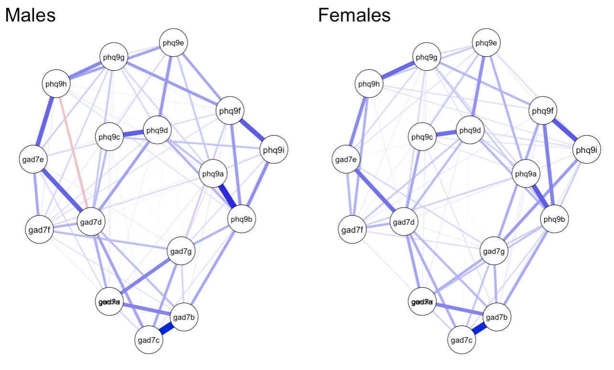

## 配布資料


### スライド

```{r, echo=FALSE, fig.align="center",out.width="50%",out.height="50%"}

```


```{r xaringan-themer, include=FALSE, warning=FALSE}
library(xaringanthemer)
style_mono_accent(
  base_color = "#43418A",
  header_font_google = google_font("BIZ UDGothic"),
  text_font_google   = google_font("BIZ UDGothic", "300", "300i"),
  code_font_google   = google_font("Fira Mono")
)
```


```{r setup, include=FALSE}
options(htmltools.dir.version = FALSE)

library(RefManageR)
BibOptions(check.entries = FALSE, bib.style = "authoryear", style = "markdown",
           dashed = TRUE)
bib <- ReadBib("PsychNetwork.bib")
```


---
class:  left

# Topic

## - ブリッジ中心性
## - ネットワークの群間比較


---
class: middle, inverse

## ブリッジ中心性 (bridge centrality) 

橋: コミュニティとコミュニティをつなぐもの


[http://www.tokachigawa.net/otofuketime/view/view17.html](http://www.tokachigawa.net/otofuketime/view/view17.html)

---
class: left

### コミュニティ
#### (community)

.pull-left[
- 各項目が所属するカテゴリー
- カテゴリーは理論的に規定*
- 黄色は不安（GAD7)、青は抑うつ（PHQ9)
#####　

### ブリッジ中心性
#### (bridge centrality)
- コミュニティ間の橋渡しにおける中心性
- 合併症のメカニズムの理解に役立つ

.footnote[[*] ブリッジ中心性の算出においては、コミュニティは理論ドリブンに設定することが想定されているが、探索的な解析に基づいてコミュニティ抽出してから中心性を算出している論文も報告されている]
]

.pull-right[
```{r, echo=F,warning=F,message=F}
library(bootnet)
load("usedata.Rdata")
results <- estimateNetwork(usedata,default = "EBICglasso", corMethod = "cor_auto")
plot(results, theme = "colorblind", cut = 0,layout = "spring",labels = TRUE,
     groups=list("GAD7"=c(1:7),"PHQ9"=c(8:16)))

```
]


---
class: left

## ブリッジ中心性指標 
#### `r Citep(bib, "jonesBridgeCentralityNetwork2021")`

### - bridge strength
### - bridge betweeness
### - bridge closeness
### - bridge expected influence


---

## ブリッジ中心性指標

.pull-left[
<font size=5><B>Bridge strength</B></font>
- 当該のノードが他のコミュニティに接続する合計。    　

- 当該のノードが他のコミュニティのノードと接続している**エッジの絶対値の合計**。  　

- 当該ノードの所属外コミュニティへの影響力。
  　
  　　
  　　　
  　　　　
  　　　　　
  　　　　　　
  　　　　　　
$$bridge \space strength = \sum_{b\ni N(a)-C} |w_{ab}|.$$
]

.pull-right[
<font size=5><B>Bridge expected influence </B></font>
- 当該のノードが他のコミュニティに接続する合計。  　
  　
  　

- 当該のノードが他のコミュニティのノードと接続しているエッジの絶対値ではなく**そのままの値**を合計。

- 当該ノードの所属外コミュニティへの**正負の**影響力。
  　
  　　
  　　　
  　　　　
  　　　　　
  　　　　　　
  　　　　　　
$$bridge \space strength =  \sum_{b\ni N(a)-C} w_{ab}.$$
]


---
class: left

## ブリッジ中心性指標

.pull-left[
<font size =5><B>Bridge betweeness</B></font>   

- 2つの異なるコミュニティからの任意の２つのノード間の最短経路上に当該のノードがある回数。  　

- 当該のノードがコミュニティ間をどのくらい媒介しているのか。  　  
  　  　  　  　　　　
  　  　  　  　　　　  　
\begin{equation}
\small x =
\begin{cases} \small 0.5, \rm{if} \space a \in P_{ij} \\ 
\small 0, \rm{otherwise}\end{cases}
\end{equation}

    
$$\small bridge \space betweeness = \sum_{i\in V}x_i. $$
]


.pull-right[
<font size =5><B>Bridge closeness</B></font>  

- 当該のノードから、他のコミュニティのすべてのノードまでの平均距離。  　

- 距離はエッジの重みの逆数（重みの大きいエッジは、より「近い」ノード）。  　

- より高い値がより近いノードを表す指標となるよう平均距離の逆数をとる。  　

  　
- 当該のノードが，どのくらい他のコミュニティに(距離が)近いのか。  　


$$\small bridge \space closeness =  \\ \small  \frac{|V-C|}{\sum_{b\in(V-C)} \sum_{e_k\in E(P_{ab})\frac{1}{w_{k}}}}.$$
]


---
class: inverse, middle

# Rでブリッジ中心性を計算

---

### 使用パッケージの読み込み

#### データ整形系  

####　

```{r,echo=T,warning=F,message=F}
library(tidyverse)
library(foreign)
library(kableExtra)
```

#### ネットワーク解析系  

####　

```{r,echo=T,warning=F,message=F}
library(bootnet)
library(qgraph)
library(psychonetrics)
library(NetworkComparisonTest)
```


---
class: left

### データの読み込み

#### Jordan et al.(2017)のデータをダウンロードして，読み込む。

```{r, echo=T,warning=F,message=F}
download.file("https://doi.org/10.1371/journal.pone.0182162.s004",
              "pone.0182162.s004.sav")
data <- read.spss("pone.0182162.s004.sav",to.data.frame=TRUE)
```

### 使用変数の抽出

#### PHQ9とGAD7のみ使用変数として抽出

```{r, echo=T,warning=F,message=F}
data %>%
  select_if(grepl("PHQ9|GAD7", names(.))) ->usedata

cns1<-colnames(usedata)
v_names<-chartr("1-9","a-i",c(1:9))
cns2<-c(paste0("gad7",v_names[1:7]),
        paste0("phq9",v_names))
cols<-setNames(cns1, cns2)

usedata %>% 
  rename_(.dots=cols) -> usedata
```


---

### ネットワークの推定

#### EBICglassoで正則化モデルで推定

```{r, echo=T,warning=F,message=F}
library(bootnet)
results <- estimateNetwork(usedata,
                           default = "EBICglasso",
                           corMethod = "cor_auto")
```

- bootnetパッケージのestimateNetwork()関数を使って，EBICでモデル選択して，パラメータ調整をするGLASSOを使う (**default=EBICglasso**)

---

### プロット

```{r, echo=T,warning=F,message=F,fig.align="center",out.width='400px',out.height = '350px'}
results_bridge<-plot(results, 
                     theme = "colorblind", 
                     cut = 0,layout = "spring",labels = TRUE, 
                     groups=list("GAD7"=c(1:7),"PHQ9"=c(8:16)))
```

**groups=list("GAD7"=c(1:7),"PHQ9"=c(8:16))**でコミュニティを指定

---

### ブリッジ中心性指標の算出

```{r,echo=T,warning=F,message=F,fig.align="center",out.height = '300px',out.width = '750px' }
library(networktools)
bridge_centrality <- bridge(results_bridge, 
                            communities=c(rep(1,7),rep(2,9)))
plot(bridge_centrality)
```
- bridge expected influenceが高いのはノード5,9
- bridge strengthが高いのはノード4,15

---

### ブリッジ中心性指標の安定性

```{r,echo=T,eval=F}
bridge_stability <- bootnet(results, nBoots = 2500, 
                            type = "case", nCores =4, 
                            statistics =  c("bridgeStrength", 
                                            "bridgeCloseness", 
                                            "bridgeBetweenness"), 
                            communities = list("GAD7"=c(1:7), 
                                               "PHQ9"=c(8:16)))
```

- bootnetパッケージのbootnet()関数を使う.
- 「type = ”case”」でケースドロップ時の安定性を推定。  

- **statistics = "bridgeStrength", "bridgeCloseness", "bridgeBetweenness"**で
  　指定する。

  - bridge expected influenceは非対応

- **communities = list("GAD7"=c(1:7),"PHQ9"=c(8:16))**でコミュニティを指定

```{r,echo=F,include=F,eval=F}
save(bridge_stability,file="stab.R")
```

```{r,echo=F}
load("stab.R")
```

---

### ブリッジ中心性指標の安定性

```{r,echo=T,warning=F,message=F,eval=F}
corStability(bridge_stability)
```

```
bridgeBetweenness: 0.594 
  - For more accuracy, run bootnet(...,  　  
  　　　　　　　　　　　　　　　　caseMin = 0.517, caseMax = 0.672) 

bridgeCloseness: 0.439 
  - For more accuracy, run bootnet(..., caseMin = 0.361,   　
  　　　　　　　　　　　　　　　　caseMax = 0.517) 

bridgeStrength: 0.672 
  - For more accuracy, run bootnet(..., caseMin = 0.594,   　
  　　　　　　　　　　　　　　　　caseMax = 0.75) 

Accuracy can also be increased by 
       increasing both 'nBoots' and 'caseN'.
```

bridge closenessはCS係数が.50をきっており不安定、解釈を控える

---

### ブリッジ中心性指標の安定性のプロット


```{r,fig.align="center",out.height = '400px',out.width = '600px'}
plot(bridge_stability,
     c("bridgeStrength","bridgeCloseness",
       "bridgeBetweenness"))
```

ブリッジ中心性指標は、サンプルをかなり減らしても，オリジナルとの相関が高い。

---
### ブリッジ中心性指標の弱み


#### `r Citet(bib, "christensenWhatBridgeCentrality2021")`

- コミュニティが3以上の場合に, どのコミュニティを区別した影響性を検討できない 

  - A -> B より A ->C の影響性が強いのかわからない  
  
- 研究間で比較が難しい  　

- 指標に効果の大きさを判断する基準がない  　


#### `r Citet(bib, "christensenEquivalencyFactorNetwork2021")`

- ネットワーク負荷量(network loadings)の活用を推奨  

  - コミュニティが3以上の場合に個々のコミュニティへの影響性を評価できる  　
  
  - 標準化指標なので、研究間の比較がしやすい  　
  
  - 効果の大きさを判断する基準があり  　
  
  - `EGAnet package`の`net.loads`関数で推定可能
  
  - ブリッジ中心性はネットワーク負荷量の総和に等しいので、情報量のより多いネットワーク負荷量の活用がよい


---
class: middle, inverse

# ネットワークの群間比較

ネットワークの構造が群間で異なるのか推測したい



---
class: left

## ネットワーク比較検定

#### Network Comparison Test 
`r Citet(bib,"vanborkuloComparingNetworkStructures2022")`


- Step1: 観察データを群ごとにネット分析し、群間差の指標を計算  　

- Step2: 観測データからリサンプリングしたデータでStep1の計算を繰り返し、群間差指標の参照分布を得る
- Step3: Step1で計算された群間差指標の値と参照分布を比較し、観察データの逸脱度を評価（統計的有意性）

```{r, echo=FALSE, fig.align="center",out.width="40%",out.height="40%"}

```


---
class: center

## ネットワーク比較検定


```{r, echo=FALSE, fig.align="center",out.width="80%",out.height="80%"}

```

[<font size=3> https://cvborkulo.files.wordpress.com/2014/09/workshop-summer-school-3-parts.pdf </font>
](https://cvborkulo.files.wordpress.com/2014/09/workshop-summer-school-3-parts.pdf)


---
class: left

## ネットワーク比較検定

### - Network invariance test
### - Global strength invariance test
### - Edge invariance test
### - Centrality invariance test


 
---
class: left

### ネットワーク比較検定

#### 1. Network structure invariance hypothesis 
- ネットワーク構造が群間で完全に等しい  　

- 個々のエッジの群間の差(の絶対値)の最大値


#### 2.Global strength invariance hypothesis*
- 群間で全体の連結レベルが等しい  　

- エッジの絶対値の総和(Global Strength)の差


#### 3. Edge strength invariance hypothesis 
- 特定のエッジが群間で等しい  　

- 特定のエッジの群間差

.footnote[[*]個々の中心性指標、ブリッジ中心性指標についても比較可能]

---
class: left

### ネットワーク比較検定

```{r, echo=FALSE, fig.align="center",out.width="100%",out.height="100%"}

```

[<font size=3> https://cvborkulo.files.wordpress.com/2014/09/workshop-summer-school-3-parts.pdf </font>
](https://cvborkulo.files.wordpress.com/2014/09/workshop-summer-school-3-parts.pdf)


---
class: middle,inverse

# Rでネットワーク比較検定

---
class: left

### 群間比較の準備

#### 性別変数を**usedata**に追加し、性別ごとのデータセットを抽出


```{r}
usedata$gender<-data$gender

usedata %>% 
  filter(gender=="Weiblich")->women

usedata %>% 
  filter(gender=="Männlich")->men
```

#### 性別ごとのデータセットでネットワーク分析を実施

```{r,warning=F,message=F}

network_male <- estimateNetwork(women, 
                                default = "EBICglasso", 
                                corMethod = "cor_auto")

network_female <- estimateNetwork(men, 
                                  default = "EBICglasso", 
                                  corMethod = "cor_auto")
```


---
### 群ごとのネットワークのプロット

#### 群間でレイアウトが一致するように調整
- 2群のネットワークの平均をとって比較するプロットのノードの位置を固定 (**averageLayout**)  

- 両群のエッジの中から最大値をとって、比較するプロットのエッジの最大値を固定 (**maximum=Max**)
  　
```{r,warning=F,message=F,echo=T, eval=F,fig.align="center",out.width="750px",out.height="450px"}
L <- averageLayout(network_male, network_female)
Max <- max(abs(c(getWmat(network_male), getWmat(network_female)))) 

layout(t(1:2))
plot(network_male, layout = L, title = "Males", maximum = Max) 
plot(network_female, layout = L, title = "Females", maximum = Max)
```

  　　
  　　　
---
### 群ごとのネットワークのプロット 　　　　
  　　　　
  　
```{r,warning=F,message=F,echo=F,fig.align="center",out.width="750px",out.height="450px"}
L <- averageLayout(network_male, network_female)
Max <- max(abs(c(getWmat(network_male), getWmat(network_female)))) 

layout(t(1:2))
plot(network_male, layout = L, title = "Males", maximum = Max) 
plot(network_female, layout = L, title = "Females", maximum = Max)
```


---
### ネットワーク比較検定

- データから欠測値を削除  　

- **test.edges=TRUE**で個々のエッジが群間で異なるか比較  　

- **test.centrality=TRUE**で個々のノードの中心性が群間で異なるか  　

- 2値データはlsing, 連続データはEBICglassoで推定  　

- 検討可能な中心性指標
  - "**closeness**", "**betweenness**", "**strength**", "**expectedInfluence**", "**bridgeStrength**", "**bridgeCloseness**", "**bridgeBetweenness**", "**bridgeExpectedInfluence**"


```{r}
library(NetworkComparisonTest)
results_NCT<-NCT(na.omit(women[,-17]),na.omit(men[,-17]), 
                 test.edges=TRUE, test.centrality=TRUE, 
                 centrality=c("expectedInfluence","bridgeStrength"), 
                 communities=c(rep(1,7),rep(2,9)),
                 progressbar=F)

```

---
### ネットワーク比較検定結果

```{r,echo=T,eval=F}
summary(results_NCT)
```

```
NETWORK INVARIANCE TEST
      Test statistic M:  0.1185867 
 p-value 0.34 

GLOBAL STRENGTH INVARIANCE TEST
      Global strength per group:  7.298997 7.196549 
 Test statistic S:  0.1024473 
 p-value 0.55 
```

いずれの指標においても群間差は示されず


---
### ネットワーク比較検定結果 (プロット)
.pull-left[
Network invariance
```{r}
plot(results_NCT,
     what="network")
```
]

.pull-right[
Global strength invariance
```{r}
plot(results_NCT,
     what="strength")
```
]

いずれの指標においても群間差は示されず


---
### ネットワーク比較検定結果

Edge strength invariance test

```{r}

results_NCT$einv.pvals%>% 
    kbl(.) %>%
      kable_styling()
```


---
### ネットワーク比較検定結果

Edge strength invariance test

```{r}

results_NCT$diffcen.pval %>% 
    kbl(.) %>%
      kable_styling()
```


---
class: left

## ネットワーク比較検定の弱み
#### `r Citet(bib,"williamsBayesianEstimationGaussian2021" )`

- 複数群間での差を検討できない  　

- エッジの群間差の不確実性を評価できない  　

- permutation testのリサンプリングは計算効率が悪い


#### `r Citet(bib,"williamsBayesianEstimationGaussian2021" )`
- ネットワーク構造をベイズ推定  　

- 事後分布や事後予測分布に基づいて、効率よく群間差を推定可能  　

- `BGGM` package で推定可能  　

- 詳細は、認知・行動療法学会で!!


---
class: left

## まとめ


#### - 合併症等のコミュニティ間の接続メカニズムの検討にブリッジ中心性が有用

#### - `networktools` package で容易に推定可能

#### - 算出したブリッジ中心性指標は他の中心性指標と同様に安定性を評価

#### - ネットワークの群間比較には、ネットワーク比較検定が有用

#### - `NeworkComparisonTest` package で容易に推定可能

#### - 全体的なネットワーク構造の群間差、個々のエッジの群間差、中心性指標の群間差が検討可能

---

####  References


```{r, results='asis', echo=FALSE}
PrintBibliography(bib)
```


---

class: center, middle

# Enjoy!

## ytake2[at]fmu.ac.jp


